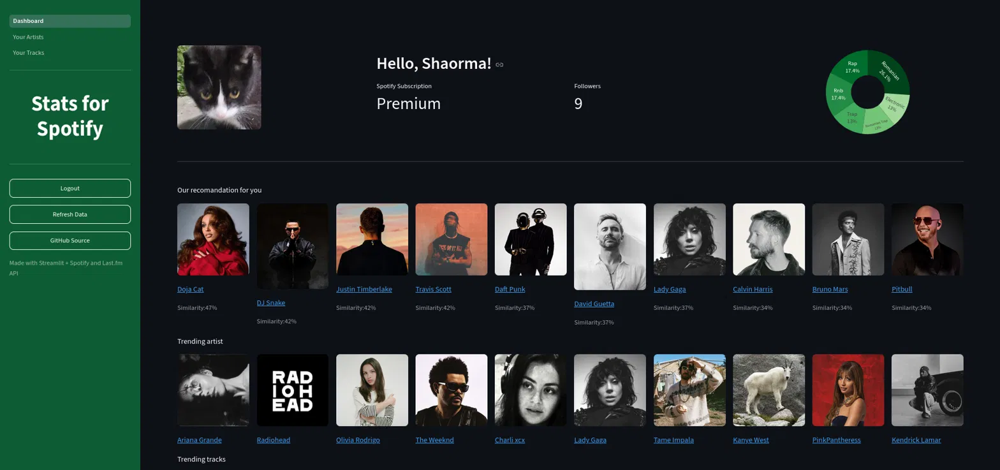
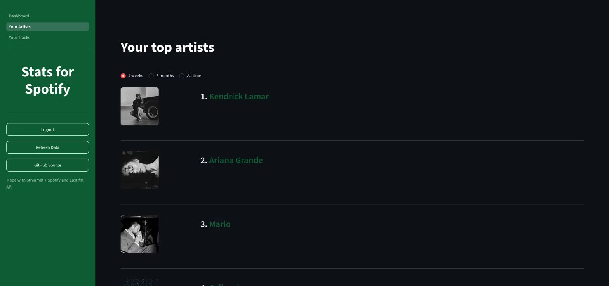
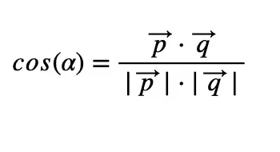

# Stats for Spotify

It's a personal web app that connects to the user's Spotify account and shows
its top artists, tracks and genres, personalizes artist recommendations plus 
trending artists and tracks worldwide.

It is built with Python, Streamlit, Spotify and Last.fm API.

🔗 **[Try it here](https://stats-for-spotify.streamlit.app/)**

> **Note:** This app is in Spotify's Development Mode, so only manually 
> approved accounts can log in. If you'd like to try it, message me your 
> Spotify account email and I'll add you as a test user.

---



---



---

## What it does

- Logs in with the user's Spotify account using an OAuth flow written manually with 
requests
- Shows users's top artists and top tracks, with option available to choose the time range
(4 weeks/6 monnths/all time)
- Shows user name, profile picture, subscription followers and build a pie chart of the
user's top genres
- Shows a recomandation row of ten recomended new artists (using algebra)
- Shows top 10 trending artists and tracks worldwide with the help of Last.fm API

---

## Recommendations algorithm

1. Collects all user's top artists and their genres (from Last.fm)
2. Build a vector that represents the user's genre profile, for example:
(a value of 8 in this vector shows that it is a very listened genre 
and a value of 1, that it is not)
3. Gets top 7 most listened genres and finds the most listened artists
that are tagged with them
4. Every candidate artist's genres are turned into a vector and compared to the 
user's genre profile using cosine similarity



5. Finally, they are sorted by score affinity and show the top 10


---

## Problems I ran into
- **Spotify stopped returning genres for artists** through their API
(confirmed by other developers on forums) so I switched to Last.fm API
for the genre data of the top artists
- **Last.fm stopped giving real artists and tracks images**, so I got the images
from Spotify, requesting them along the spotify links
- **The recommendations took too long to load** - added caching and parallel requsting,
since gathering genres one by one for over 50 artists was way too slow

---

## Build with
- Python
- Streamlit
- Spotify Web API (authentification, top artists/tracks, images)
- Last.fm API (genres, global charts)
- NumPy (for recommendation feature)
- Plotly (genre chart)

--

## How to run

1. ```bash
    pip install -r requirements.txt
    ```
    
2. Copy 'config.example.py' to 'config.py' and fill the data

3. ```bash
    streamlit run Dashboard.py
    ```

